# Runway — How to Use

Runway is a year-at-a-glance planner. The top half shows a Gantt-style timeline of phases (projects, goals, trips, etc.). The bottom half shows a scrollable day-by-day task list for the whole year.

---

## The layout

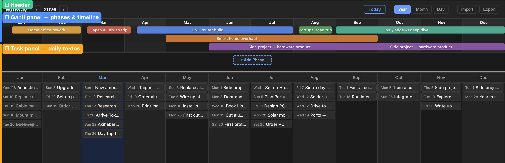

The window is split into three areas:

| Area | What it is |
|---|---|
| **① Header** | Year navigation, view controls, backup tools |
| **② Gantt panel** | Horizontal bars representing phases over time |
| **③ Task panel** | Day columns with task cards |

The two panels scroll together horizontally — scrolling one scrolls the other.

---

## Header

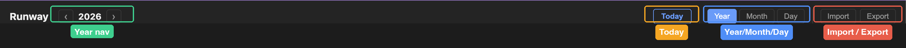

From left to right:

- **Runway** — app name
- **‹ 2026 ›** — year selector; click the arrows to move to the previous or next year
- **Today** — jumps to today's date in Day view
- **Year / Month / Day** — zoom level buttons
- **Import / Export** — backup and restore your data

---

## Changing the view

| | |
|---|---|
| 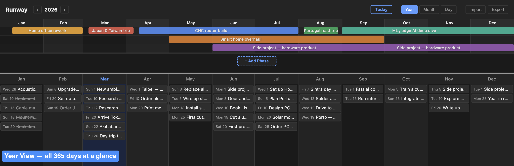 | **Year** — all 365 days fit the screen. Great for a high-level overview of the whole year. |
| 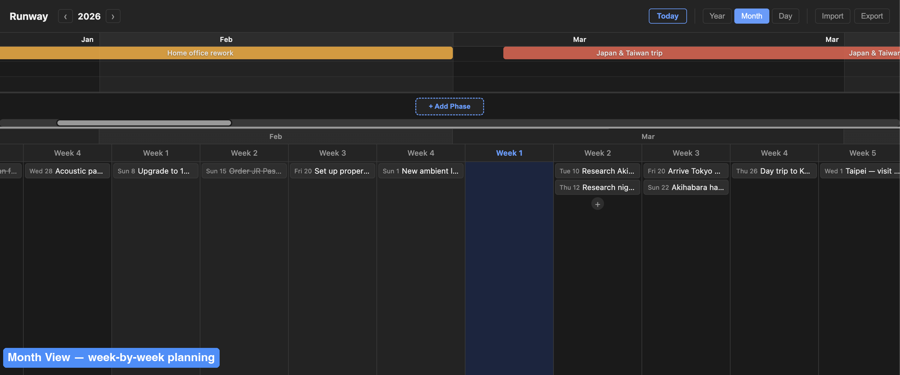 | **Month** — week-by-week columns. Good for planning a few weeks ahead. |
| 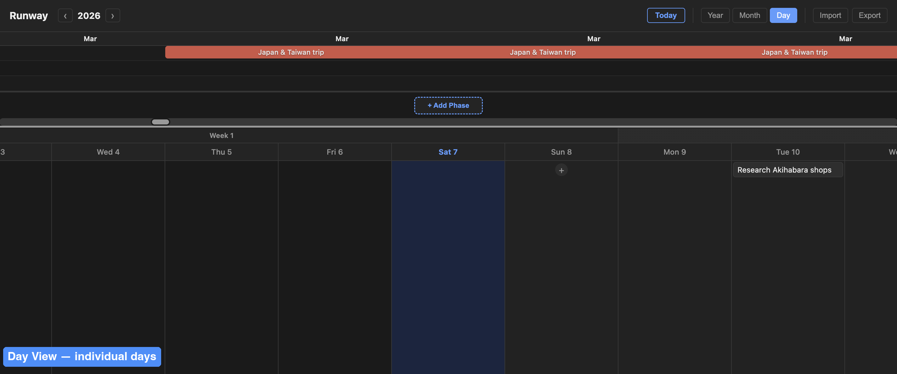 | **Day** — full day columns with room to read task titles. |

Click **Year**, **Month**, or **Day** in the header to switch views. Switching keeps the same date centred in the viewport.

Clicking a **month label** in Year view zooms into Month view centred on that month. Clicking a **week label** in Month view zooms into Day view.

---

## Navigating years

Click **‹** or **›** next to the year in the header to move to the previous or next year. The Gantt and task panels both update to show that year's dates.

Click **Today** to jump back to the current year and scroll to today.

---

## Phases (Gantt panel)

Phases represent anything with a start and end date — a project, a quarter, a trip, a deadline.

### Viewing phases

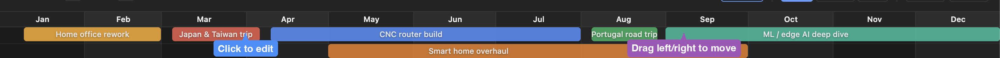

Each coloured bar spans from its start to end date. Bars are automatically packed into rows so overlapping phases don't obscure each other.

### Adding a phase

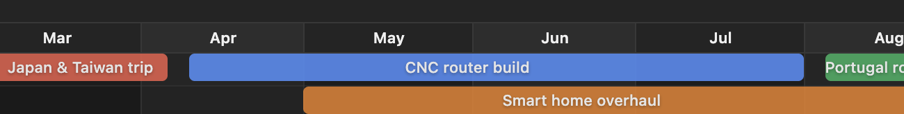

Click **+ Add Phase** at the bottom of the Gantt panel, or **double-click** anywhere in the bars area. A new phase is created starting today and the edit modal opens immediately.

### Editing a phase

Click any phase bar to open the edit modal. You can change:

- **Title** — press Enter to save quickly
- **Start date / End date** — click the date field to open the date picker
- **Color** — pick from 8 presets or use the colour picker for any custom colour

Click **Save** or press **Enter** to apply. Click **Delete** to remove it. Click outside or press **Escape** to cancel.

### Moving a phase

Click and drag a phase bar left or right to shift its dates. The bar snaps to whole days and is clamped to the current year.

### Resizing the Gantt panel

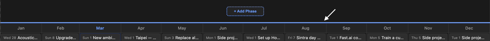

Drag the thin bar between the Gantt panel and the task panel up or down to give more or less space to each section.

---

## Tasks (task panel)

Tasks live on a specific day. Each day is a column; tasks stack vertically inside it.

### Adding a task

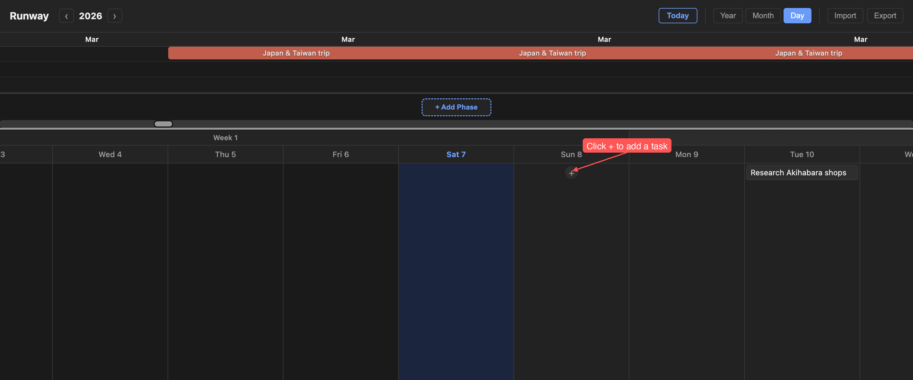

Click the **+** button at the bottom of any day column. A new task is created on that day and the edit modal opens immediately.

### Editing a task

Click any task card to open the edit modal. You can change:

- **Date** — move the task to a different day
- **Title** — press Enter to save quickly
- **Description** — optional multi-line notes
- **Completed** — tick the checkbox to mark it done

Click **Save** or press **Enter** to apply. Click **Delete** to remove it. Click outside or press **Escape** to cancel.

### Completing or deleting a task quickly

Right-click any task card to get a quick context menu:

- **Mark Complete / Mark Incomplete** — toggles completion without opening the modal
- **Delete** — removes the task immediately

### Dragging tasks

Drag a task card to a different day column to move it. Drag within the same column to reorder.

### Completed tasks

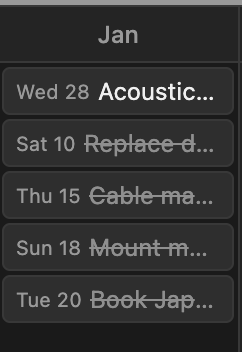

Completed tasks appear with a strikethrough and reduced opacity — still visible, but out of the way.

---

## Data & backups

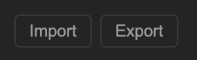

Your data is saved automatically every time you make a change. No manual save needed.

Runway also writes a plain-text backup file to your Documents folder:

- **Mac:** `~/Documents/runway/runway-backup.txt`
- **Windows:** `Documents\runway\runway-backup.txt`

Daily snapshots (kept 30 days) are saved under `runway/daily backups/`.

### Export

Click **Export** in the header to download a `runway-backup.txt` file. Use this to transfer data to another machine or keep a manual backup.

### Import

Click **Import** and select a `runway-backup.txt` file. This replaces all current data — export first if you want to keep it.

---

## Dark mode

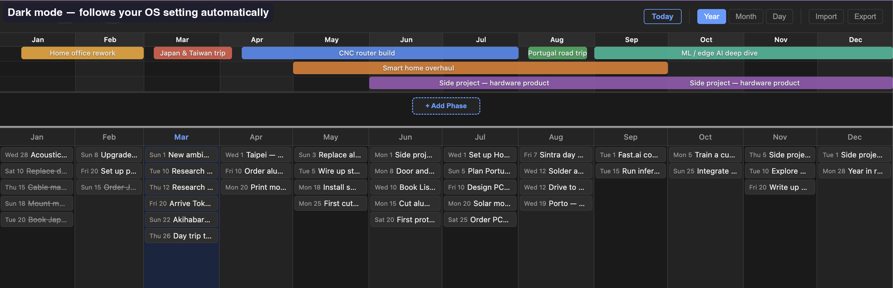

Runway follows your system appearance by default. Use the **☀️ / 🌙** button in the header to override it — your choice is remembered.

---

## Keyboard shortcuts

| Key | Action |
|---|---|
| **Escape** | Close any open modal |
| **Enter** | Save the open modal |

---

## Tips

- Use **Year view** at the start of the year to lay out big phases — projects, trips, quarters.
- Switch to **Day view** for daily task work; the Gantt stays visible at the top so you can see which phase you're in.
- **Today** always takes you back to right now in Day view, regardless of year or zoom level.
- Drag the resize handle to collapse the Gantt while you focus on tasks, or expand it while rearranging phases.
