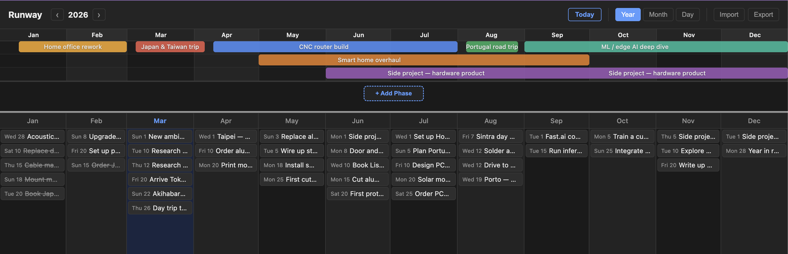

# Runway

A year-at-a-glance planner with Gantt phases for long-term goals and a daily task panel — offline, no accounts.

## Install

Download the latest release from [github.com/anandghanw/runway/releases](https://github.com/anandghanw/runway/releases).

- **Mac** — download the `.dmg`, drag Runway to Applications
- **Windows** — download the `.exe` installer, run it, find Runway in the Start Menu

---

## The story

I've always liked todo lists. Cards, checkboxes, kanban boards — the satisfaction of ticking things off. But they all had the same problem: **no sense of scale across time**.

A todo list tells you *what* to do. It doesn't tell you *when* it fits, how long it spans, or how today's tasks connect to the bigger picture you have in your head.

I wanted both. The immediate ("what am I doing today?") and the long-range ("what does this month look like, and is that project actually going to finish before my trip?").

So I built Runway.

---

## What it is

At the top there's a **Gantt-style timeline** — phases that span days, weeks, or months. Think of them as your longer-horizon goals or projects: a trip you're planning, a side project with a rough deadline, a home renovation. You can see the whole year at a glance, drag phases around, and get an honest look at whether your plans make sense together.

Below that is a **task panel** — individual tasks tied to specific days. Same data, different lens. Switch between:

- **Year view** — see the whole year, where your phases sit, what's coming
- **Month view** — week-by-week, good for medium-term planning
- **Day view** — today and the days around it, what actually needs to happen now

The two panels are linked. A task on March 12 sits visually beneath whatever phase spans that week. You can see at a glance whether a busy week of tasks lines up with a phase deadline.

---

## The work diary part

This turned out to be one of the most useful things about it.

Every task you log is timestamped to a day. Over time the app becomes a record of what you actually did — not what you planned, but what happened. You can **export the whole thing** as a plain text file and hand it to an LLM to get a summary, a retrospective, or help writing a weekly update.

It's a planning tool and a work diary at the same time.

---

## How it was built

Vibe coded with Claude Code (Sonnet 4.6) over a weekend.

It's a React + TypeScript app running in Electron — so it lives as a native desktop app on Mac and Windows, works fully offline, stores everything locally. No accounts, no cloud, no subscriptions.

Could have bugs. Probably does. But it works well enough to be genuinely useful day to day.

---

## Bugs / contributions

This was a weekend vibe-coding project, not a polished product. There are probably edge cases I haven't hit yet.

If you find a bug or something feels off — open an issue or let me know.

If you want to fix it or add something — do it yourself or vibe it with whatever LLM you like. Clone the repo, run it locally (see [DEVELOPER_GUIDE.md](DEVELOPER_GUIDE.md)), make your change, send a PR.

---

## Docs

- [How to use the app](HOW_TO_USE.md)
- [Developer guide](DEVELOPER_GUIDE.md)
